# TP 2 - Exploration du *réseau* d'un point de vue *client*

## I. Exploration locale en solo

###     1. Affichage d'informations sur la pile TCP/IP locale

**En ligne de commandes**

Taper 'ipconfig /all' dans l'invite de commandes ('ifconfig' sur Linux ou Mac)

Interface WiFi :  
    Nom : Carte réseau sans fil Wi-Fi  
    Adresse MAC : 30-24-32-5A-22-38  
    Adresse IPv4 : 10.33.1.57 /22  
    Adresse de réseau : 10.33.0.0  
    Adresse de broadcast : 10.33.3.255  
    Passerelle par défaut : 10.33.3.253  

Interface Ethernet :  
    Nom : Carte Ethernet Ethernet  
    Adresse MAC : 0C-9D-92-57-58-95  
    Adresse IP : Inexistante car non connecté   
    Adresse de réseau : Inexistante car non connecté   
    Adresse de broadcast : Inexistante car non connecté   

La gateway d'Ingésup est une IP réelle, portée par un équipement présent sur le réseau Ingésup.
Elle permet de sortir du réseau, pour se connecter sur Internet par exemple.

**En graphique**

Panneau de configuration > Réseau & Internet > Aficher vos propriétés réseau

###     2. Modifications des informations

####        A. Modification d'adresse IP - pt. 1
* 1ère adresse du réseau disponible : 10.33.0.1
* Dernière adresse du réseau disponible : 10.33.3.254 (exclure 10.33.3.253 qui est la gateway)

Pour changer son adresse IP de la carte WiFi (sous Windows) :

1. Rendez-vous dans les propriétés du gestionnaire WiFi (Panneau de configuration > Réseau et Internet > Wi-Fi > Centre Réseau & partage)
2. Cliquez sur votre connexion (ici 'Wi-fi (WiFi@YNOV)'), puis sur Propriétés > Protocole Internet version 4 (TCP/IPv4) > Propriétés
3. Choisir l'option 'Utiliser l'adresse IP suivante :' et rentrez une adresse IP comprise entre la 1ère et la dernière adresse IP disponible (calculez plus tôt)
* Masque de sous-réseau : 255.255.252.0
* Passerelle par défaut : 10.33.3.253
* Serveur DNS préféré : 10.0.10.20
* Serveur DNS auxiliaire : 8.8.8.8

####        B. nmap
Installez Nmap, puis ouvrir une invite de commandes. Rendez-vous dans le dossier dans lequel Nmpa est installé et tapez 'nmap -sn -PE 10.33.0.0/22'
L'outil va scanner le réseau est afficher toutes les adresses IP utilisées dans l'ordre croissant.

####        C. Modification d'adresse IP - pt. 2
Choississez une adresse IP libre grâce à Nmap et modifiez votre adresse IP actuelle (voir I.2.A.)
Dans notre cas on choisira 10.33.3.250
En changeant notre adresse de gateway en 10.33.3.251, il nous est impossible d'accèder à Internet

## II. Exploration locale en duo

###      1. Prérequis

* deux PCs avec ports RJ45
* un câble RJ45
* **firewalls désactivés** sur les deux PCs

Pour désactiver le firewall (le pare-feu), se rendre dans :
Paramètres > Mise à jour & Sécurité 
Dans l'onglet Sécurité de Windows > Pare-feu et protection réseau
Puis désactivez chacun des réseaux (avec domaine, privé, public).

###      2. Câblage
Ok c'est la partie tendue. Prenez un câble. Branchez-le des deux côtés. Hop.

###      3. Modification d'adresse IP

1. Pour modifier l'IP des deux machines pour qu'elles soient dans le même réseau, suivez les mêmes étapes que dans la partie locale en solo (à l'étape 2 cliquez sur Ethernet)
2. Vérifiez à l'aide de commandes que vos changements ont pris effet (voir ipconfig partie I. 1.)
3. Utilisez ping pour tester la connectivité entre les deux machines
4. Testez avec un /20, puis un /24, puis le plus petit réseau que vous trouvez.
* Avec un /24  

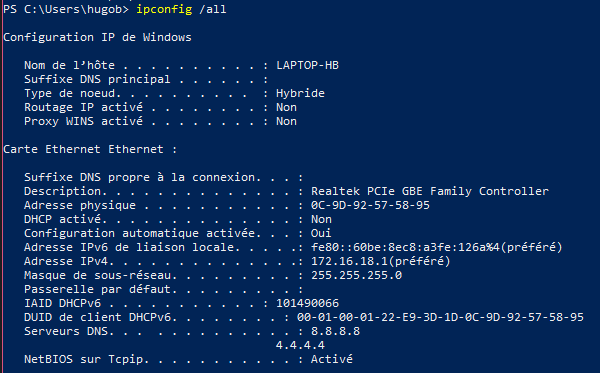  
  
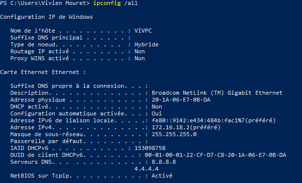  
  
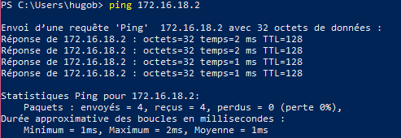  
  
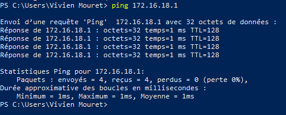  
  
* Avec un /30  
  
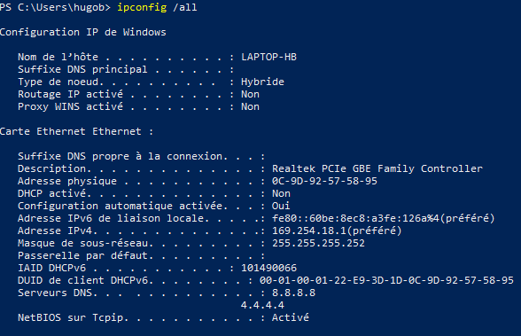  
  
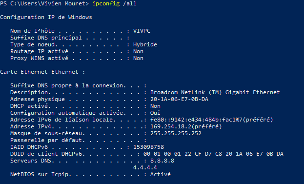  
  
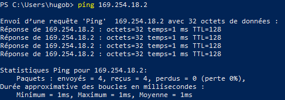  
  
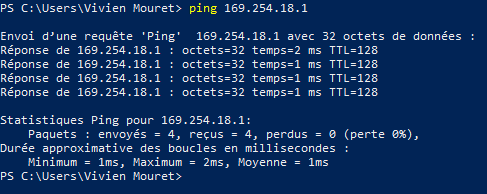  
  
    
###      4. Utilisation d'un des deux comme gateway

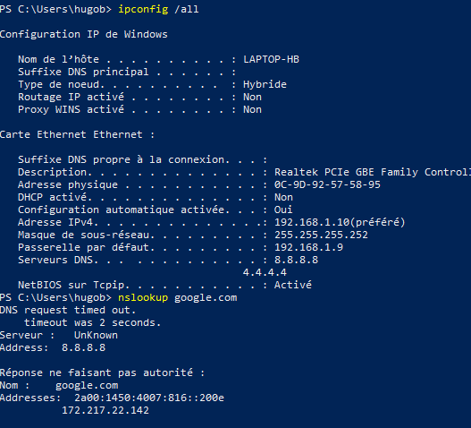

###      5. Petit chat privé ?

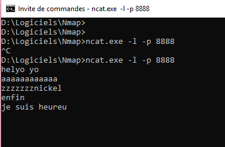

###      6. Wireshark

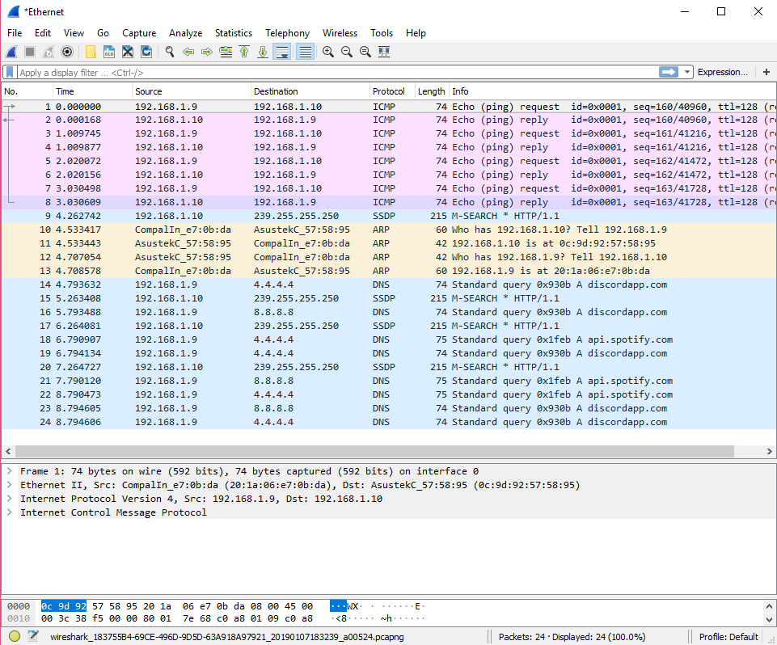

###      7. Firewall

1. Activer votre fireweall
2. Autoriser _ping_
    - Sur Windows Defender, accèder aux paramètres avancés pour ajouter une nouvelle règle personnalisée de trafic entrant. Elle devra s'appliquer à tous les programmes, sélectionnez le protocole ICMPv4, puis autoriser la connexion à toutes les adresses IP.
3. Autoriser nc
    - Refaire la même manip mais appliquez la règle uniquement au programme nc.exe

## III. Manipulations d'autres outils/protocoles côté client

###      1. DHCP

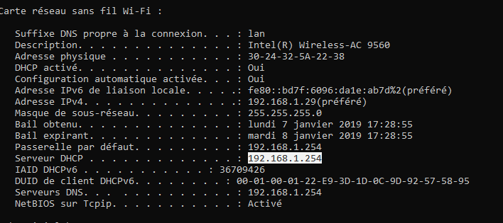  
  
On remarque que notre serveur DHCP a la même adresse IP que notre passerelle par défaut.  
Notre bail d'expiration sera 24h après l'obtenu de celui-ci.

###      2. DNS

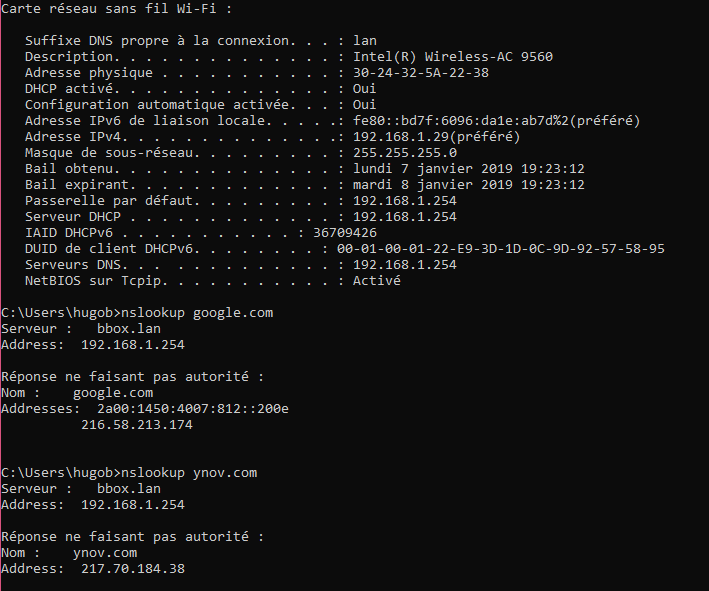  
  
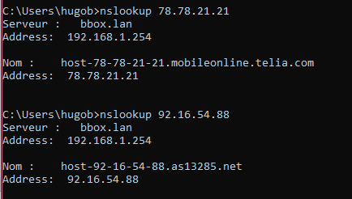

###      3. Bonus : pour aller plus loin

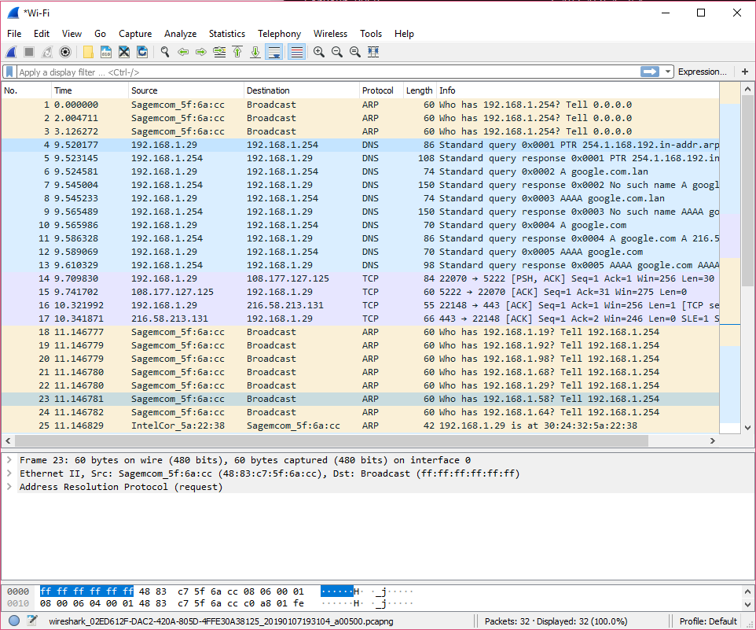

Concernant les différences entre WiFi et câble ; 
Le Wifi est clairement plus pratique qu’une connexion câblée. Mais l’ethernet offre toujours certains avantages (vitesses plus élevées, moins de latence et pas de problème d’interférences).