# TP 3 - Plusieurs réseaux : routage statique

## I. Création et utilisation simples d'une VM CentOS

### 4. Configuration réseau d'une machine CentOS

a. On utilise la commande _curl_ qui permet de faire des requêtes HTTP pour prouver que l'on a internet.

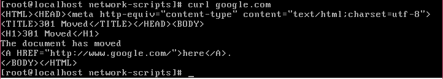  

b. On ping notre VM depuis notre PC et inversement.

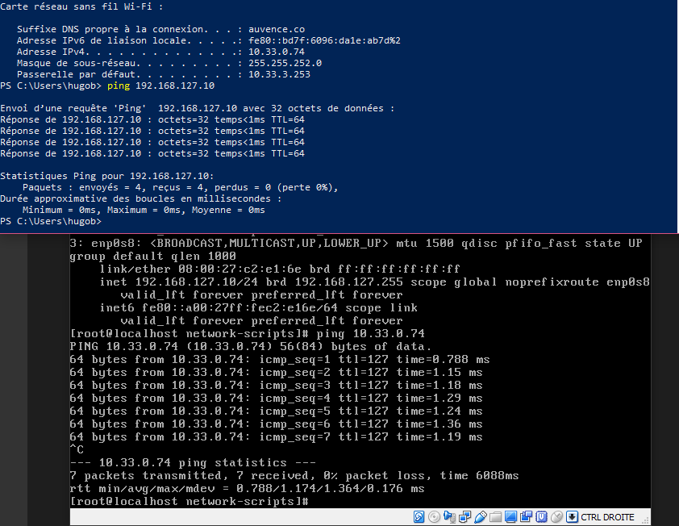

c. On utilise la commande _route PRINT -4_ sur notre PC et _ip route_ sur notre VM pour afficher la table de routage.

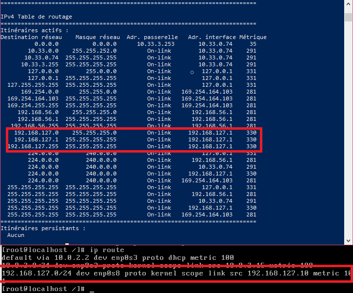

### 5. Faire joujou avec quelques commandes

Pour le ping et la table de routage, cf. ci-dessus.  

Pour télécharger un fichier on utilise _curl_:

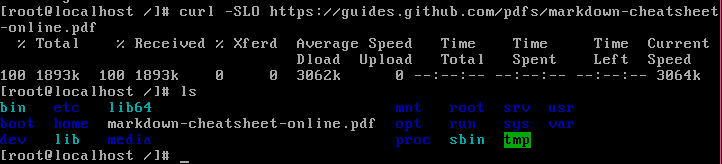

Pour connaître l'adresse IP d'un site, on utilise _dig_:

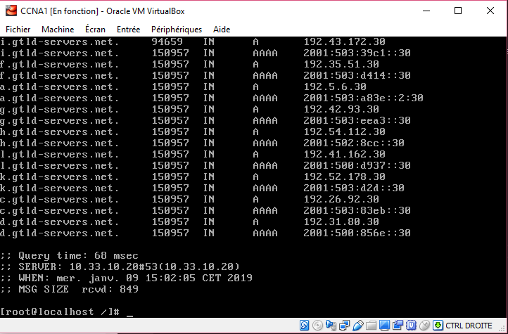

## II. Notion de ports et SSH

### 1. Exploration des ports locaux

Utilisez la commande ss pour lister les ports TCP sur lesquels la machine virtuelle écoute.
Ajoutez l'option :
* -t pour avoir les ports TCP
* -l pour avoir les ports en écoute
* -n pour avoir le numéro du port, plutôt qu'un nom
* -p pour connaître l'application qui écoute sur ce port

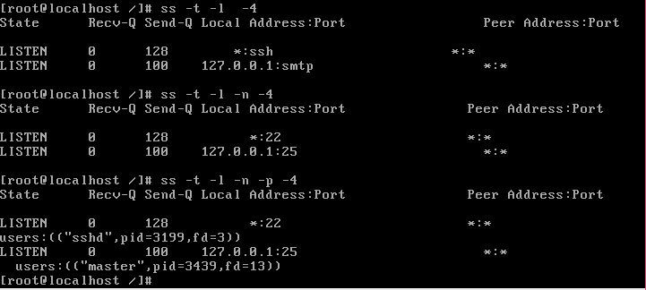

### 2. SSH

Pour configurer Putty, rentrez l'adresse IP de la VM et le port sur lequel le serveur écoute. (dans notre cas l'IP 192.168.127.10 et le port 22).

Voici ce qu'on obtient :

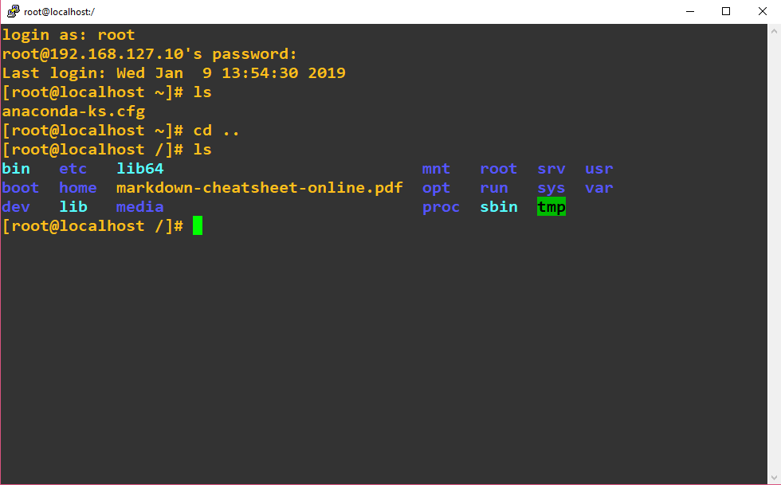

### 3. Firewall

A. En modifiant simplement le fichier `/etc/ssh/sshd_config`,(à la ligne #Port 22 supprimez le '#' et mettez 2222), la connexion échoue car il faut aussi autoriser les connexions sur le port TCP 2222 avec la commande _firewall-cmd --add-port=2222/tcp --permanent_. 

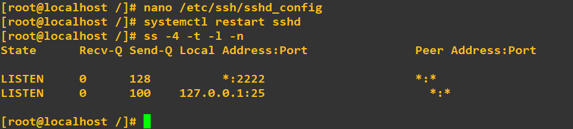

B. Pour installer ncat, utilisez la commande _yum install nmap-ncat_.

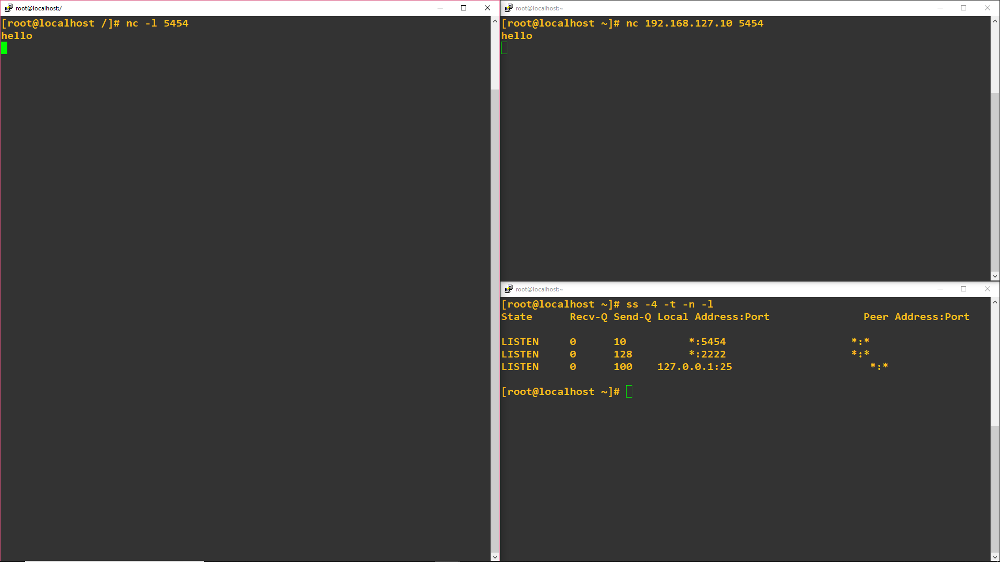

## III. Routage statique

### 1. Préparation des hôtes (vos PCs)

On vérifie que le PC1 ping la VM1 et le PC2 :

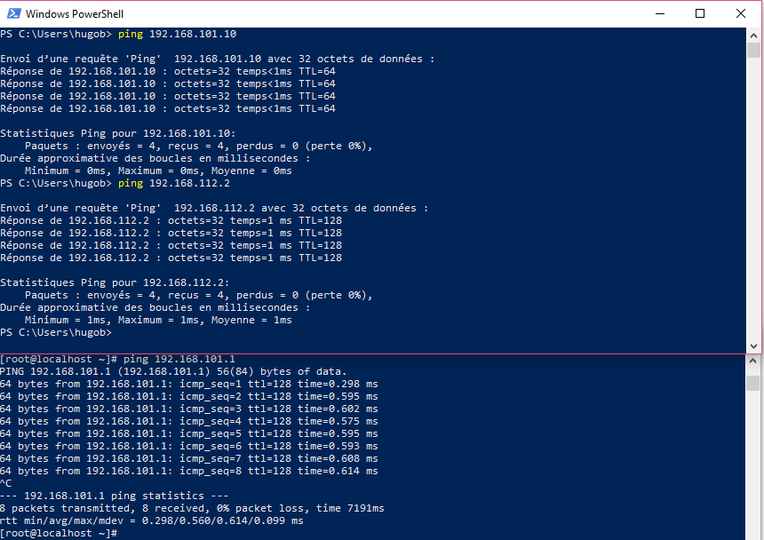

On vérifie que le PC2 ping la VM2 et le PC1 :

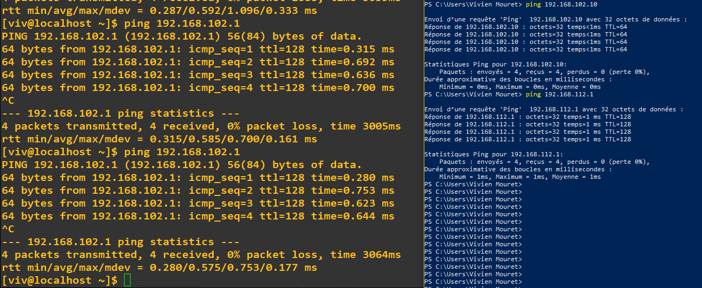  
  
La table de routage du PC1 :  

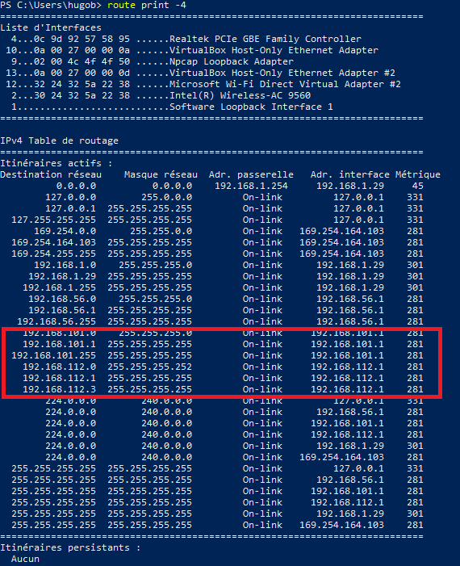

La table de routage du PC2 :

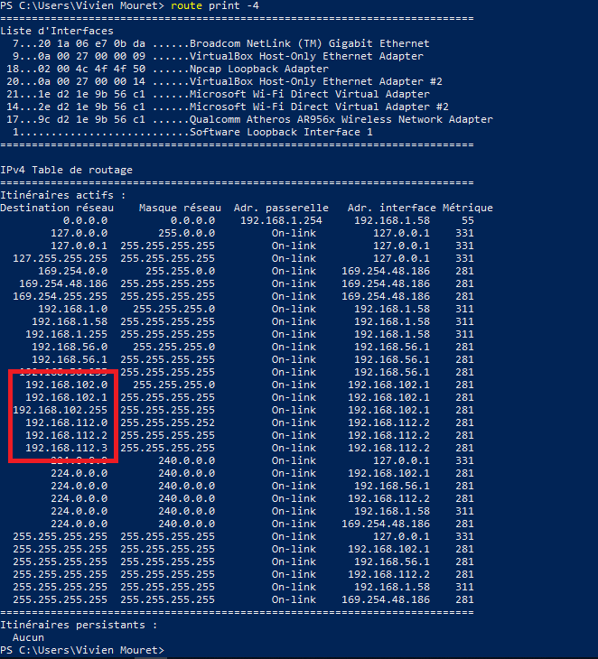

On y remarque le réseau 12 sur les deux PCs et les réseaux 1 et 2 pour les PC1 et PC2 respectivement.

### 2. Configuration du routage

**Réseau 1 :**  
  
Adresse réseau : 192.168.101.0  
  
Masque réseau : 255.255.255.0  
  
Adresse IPv4 PC1 : 192.168.101.1  
  
Adresse IPv4 VM1 : 192.168.101.10   
  
  
**Réseau 2 :**  
  
Adresse réseau : 192.168.102.0  
  
Masque réseau : 255.255.255.0  
  
Adresse IPv4 PC2 : 192.168.102.1  
  
Adresse IPv4 VM2 : 192.168.102.10  
  
  
**Réseau 12 :**  
  
Adresse réseau : 192.168.112.0  
  
Masque réseau : 255.255.255.252  
  
Adresse IPv4 PC1 : 192.168.112.1  
  
Adresse IPv4 PC2 : 192.168.112.2   
  
-----

Le PC1 parvient désormais à ping l'adresse du PC2 dans le réseau 2 :
  
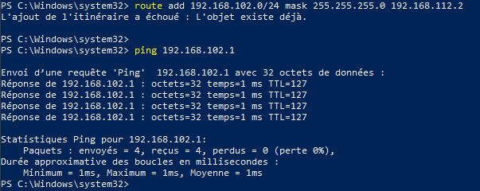 

Le PC2 parvient à ping l'adresse du PC1 dans le réseau 1 :
  
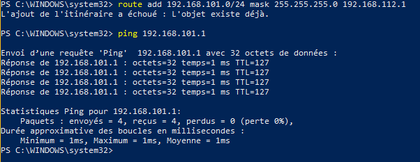  

La VM1 parvient à ping le PC2 dans le réseau 12 et 2 :
  
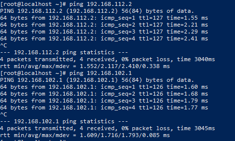  

La VM2 parvient à ping le PC1 dans le réseaux 12 et 1 :
  
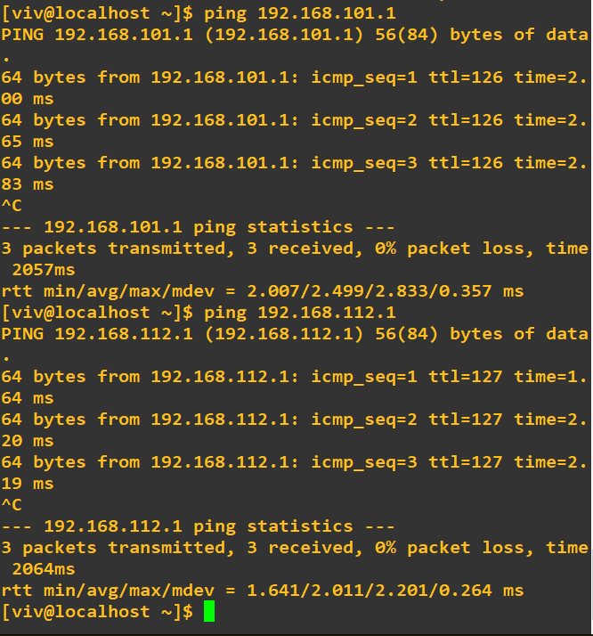  
  
### 3. Configuration des noms de domaine

La VM1 peut ping tous les FQDN y compris vm2.tp3.b1 :

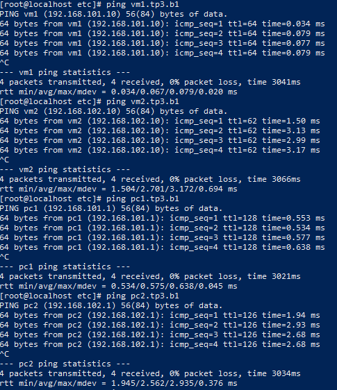  

La VM2 peut ping tous les FQDN y compris vm1.tp3.b1 :
  
.png)  
.png)  
  
Ci-dessous on peut voir un utltime netcat entre vm1.tp3.b1 et vm2.tp3.b1, tout d'abord avec la vm1 comme serveur :  

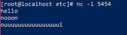  
  
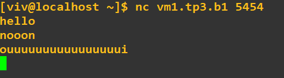  
  
Et maintenant avec la vm2 comme serveur :

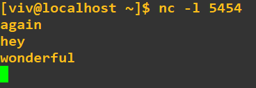  
  
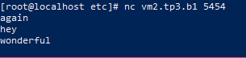  

