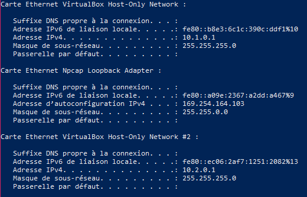
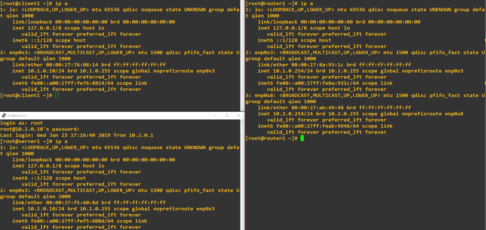
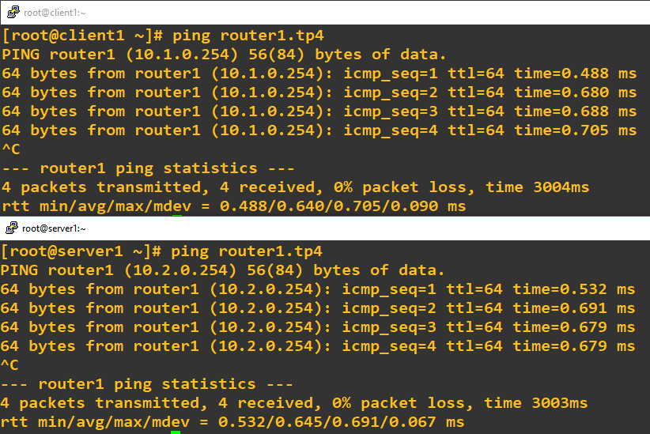
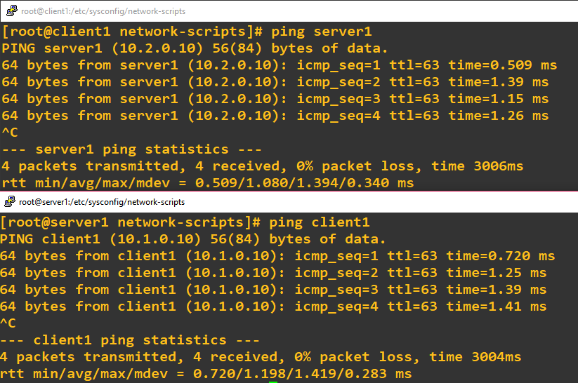
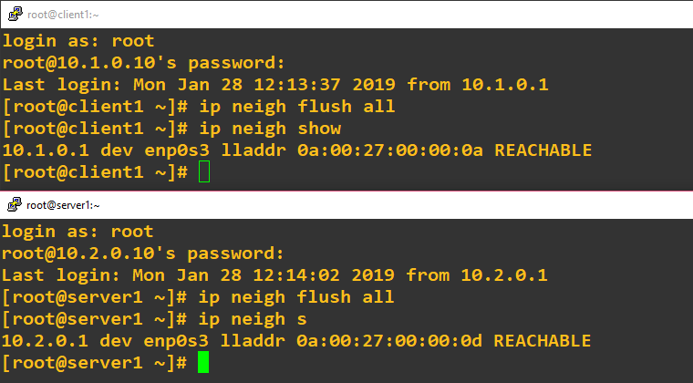
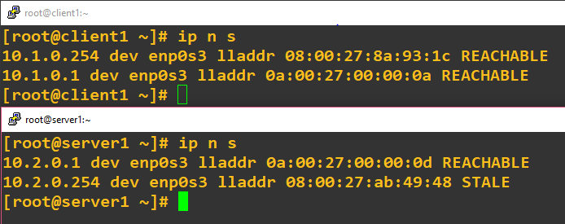
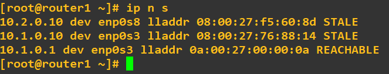

# TP 4 - Spéléologie réseau : descente dans les couches

## I. Mise en place du lab

### 1. Création des réseaux

Sur le screen ci-dessus, on peut voir que notre PC possède bien une carte réseau sur le `net1` et une carte réseau sur le `net2` :  
  
  
  
### 2. Création des VMs

On vérifie que l'on a bien défini une IP statique pour chaque VM :  
  
  
  
Et on tente un premier ping de `client1` vers `router1.tp4` sur l'IP 10.1.0.254 et un deuxième de `server1` vers `router1.tp4` sur l'IP 10.2.0.254 :  
  
  
  
### 3. Mise en place du routage statique
  
Pour vérifier que notre routage statique soit effectif, on ping :  
  
  
  
Un traceroute depuis le client vers le serveur :  
  
  
  
## II. Spéléologie réseau

### 1. ARP
  
#### A. Manip 1  
  
Une fois les tables ARP vidées, il ne reste que l'adresse du PC sur les réseaux 1 et 2 pour respectivement, client1 et server1 :  
  
  
  
Lorsque l'on ping server1 depuis client1, une nouvelle adresse MAC apparaît, celle de notre routeur :

  
  
On peut remarquer que ce sont deux adresses MAC différentes car le router possède 2 cartes réseau (pour le réseau 1 et le réseau 2).  

C'est logique puisque pour atteindre server1, client1 a dû passer par router1 depuis le réseau 1 et server1 a reçu le ping depuis router1 également mais sur le réseau 2.  

#### B. Manip 2  
  
Lorsque l'on vide puis que l'on affiche la table ARP du router1, celle-ci est vide sauf si l'on y est connecté via SSH. Nous aurons alors l'adresse de notre PC sur le réseau 1 ou 2 celon l'adresse IP avec laquelle on accède au router1 via SSH.  
  
Après un ping de server1 depuis client1 :  
  
  

Deux adresses se sont rajoutés, celles de client1 et de server1. C'est parce que le ping de client1 vers server1 doit passer par router1, server1 n'étant pas dans la table ARP de client1 ce dernier envoie le ping à l'adresse MAC de broadcast et donc router1 le reçoit, puis l'envoie à server1.  
  
#### C. Manip 3  
  
On remarque qu'une adresse s'est rajoutée pour les interfaces sur les réseaux 1 et 2 :  
  
`239.255.255.250       01-00-5e-7f-ff-fa     statique`  
  
Cette adresse est rajoutée automatiquement par notre passerelle et le protocole SSDP, elle permet le multi-cast d'adresses.  
  
#### D. Manip 4  
  
Si l'on active la carte NAT sur client1 et que l'on se connecte sur internet, une nouvelle adresse est rajoutée à notre table ARP : `10.0.2.2`.  
  
Il s'agit de l'adresse de l'interface de loopback de notre hôte, utilisé pour se connecter à internet.  
  
### 2. Wireshark  
  

  
