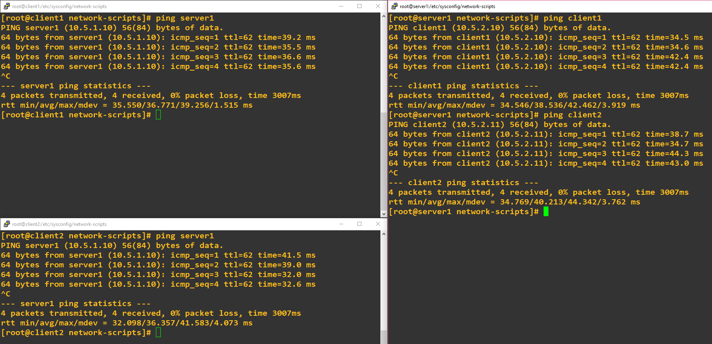
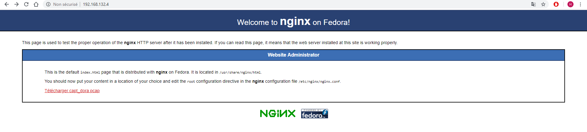

# TP 5 - Premier pas dans le monde Cisco  
  
## II. Lancement et configuration du lab 

Pour vérifier que nous avons bien configuré notre lab, on ping `server1` depuis `client1`et `client2`, et réciproquement :  
  
  
  
## III. DHCP

### 1. Mise en place du serveur DHCP

Apès avoir recycler notre VM `client2.tp5.b1` en serveur DHCP nommé `dhcp-net2.tp5.b1`, on peut obtenir une nouvelle IP sur notre VM `client1` si l'on configure notre interface en dynamique.  
  
On utilise tout d'abord la commande `dhclient -v -r` pour lâcher notre bail DHCP puis la commande `dhclient -v` pour en demander une nouvelle.  
  
Dans notre cas on est donc passer de l'adresse IP `10.5.2.10` à `10.5.0.51`.  
  
### 2. Explorer un peu DHCP

Après avoir au préalable fait un *DHCPRELEASE* sur l'interface de `client1`, on décide de lancer une capture de l'échange du DORA depuis `dhcp-net2`grâce à `tcpdump` :  
  
`tcpdump -i enp0s3 -w capt_dora.pcap`  
  
Pour récupèrer notre fichier sur notre PC, nous allons installer un serveur web sur `server1`. Nous pouvons déjà envoyé le fichier *capt_dora.pcap* sur `server1` :  
  
`scp capt_dora.pcap root@server1:~`  
  
### 3. Bonus

Le serveux web installé (grâce au package *nginx*), nous pouvons vérifier qu'il est accessible en se connectant depuis notre PC :  
  
    
  
Ensuite nous allons modifier le fichier *index.html* pour insèrer un lien permettant de télécharger notre fichier *capt_dora.pcap*.  
  
Bon finalement la chose n'est pas si simple donc nous allons finalement abandonner cette manip.
