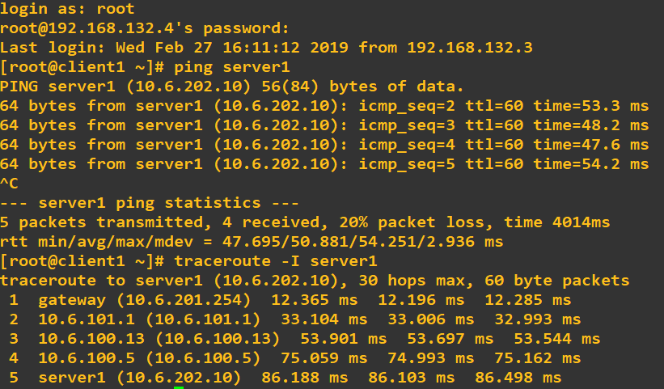

# TP 6 - Une topologie qui ressemble un peu à quelque chose, enfin ?

## Configuration de OSPF

Nous pouvons vérifier que la configuration c'est bien passé grâce à un `ping` et un `traceroute`:  
    
  
  
## Let's end this properly

