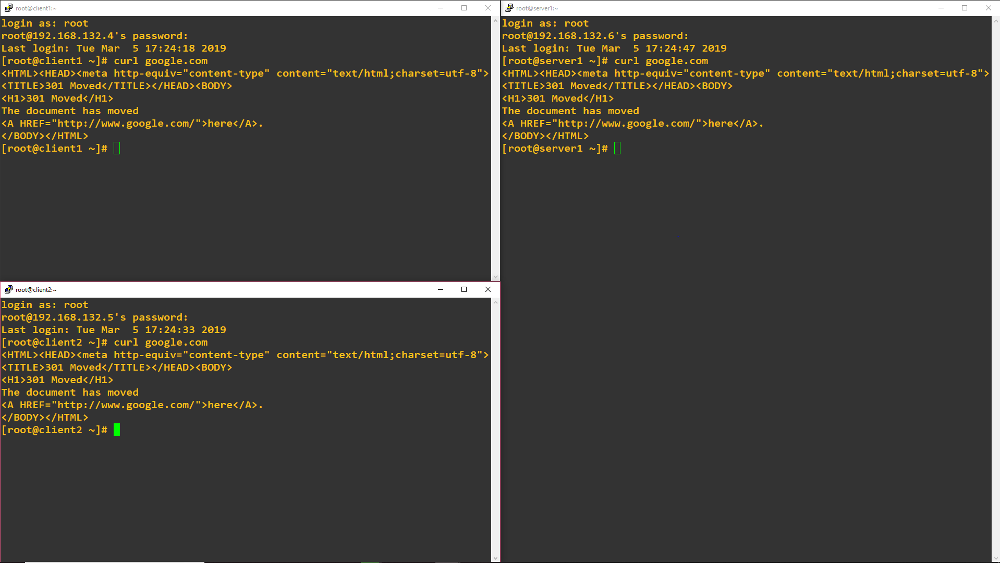
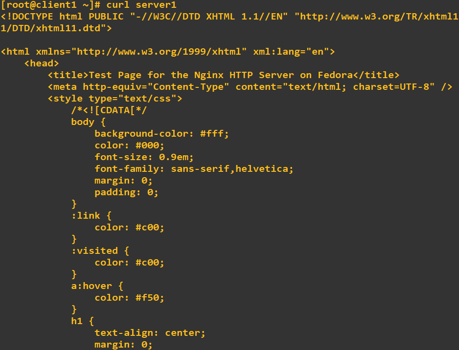

# TP 6 - Une topologie qui ressemble un peu à quelque chose, enfin ?

## Configuration de OSPF

Nous pouvons vérifier que la configuration c'est bien passé grâce à un `ping` et un `traceroute`:  
    
  
  
## Let's end this properly

### 1. NAT : accès internet

On peut vérifier que le NAT est activé en effectuant un `curl 8.8.8.8` sur chacune des machines :  
  
  
  
### 2. Un service d'infra

Notre serveur web installé, on peut y accèder depuis *client1* avec un `curl server1`:  
  
  
  
### 3. Serveur DHCP

Aprés installation du serveur DHCP et modification du fichiers */etc/dhcp/dhcpd.conf*, nous pouvons utiliser notre serveur DHCP :

```
[root@client1 ~]# dhclient -v -r
Internet Systems Consortium DHCP Client 4.2.5
Copyright 2004-2013 Internet Systems Consortium.
All rights reserved.
For info, please visit https://www.isc.org/software/dhcp/

Listening on LPF/enp0s8/08:00:27:9d:7e:b9
Sending on   LPF/enp0s8/08:00:27:9d:7e:b9
Listening on LPF/enp0s3/08:00:27:06:80:31
Sending on   LPF/enp0s3/08:00:27:06:80:31
Sending on   Socket/fallback
DHCPRELEASE on enp0s3 to 10.6.201.11 port 67 (xid=0x53c11051)
[root@client1 ~]# dhclient -v
Internet Systems Consortium DHCP Client 4.2.5
Copyright 2004-2013 Internet Systems Consortium.
All rights reserved.
For info, please visit https://www.isc.org/software/dhcp/

Listening on LPF/enp0s8/08:00:27:9d:7e:b9
Sending on   LPF/enp0s8/08:00:27:9d:7e:b9
Listening on LPF/enp0s3/08:00:27:06:80:31
Sending on   LPF/enp0s3/08:00:27:06:80:31
Sending on   Socket/fallback
DHCPDISCOVER on enp0s8 to 255.255.255.255 port 67 interval 5 (xid=0x517a0807)
DHCPDISCOVER on enp0s3 to 255.255.255.255 port 67 interval 8 (xid=0x5f2ddd66)
DHCPREQUEST on enp0s3 to 255.255.255.255 port 67 (xid=0x5f2ddd66)
DHCPOFFER from 10.6.201.11
DHCPACK from 10.6.201.11 (xid=0x5f2ddd66)
bound to 10.6.201.50 -- renewal in 261 seconds.
[root@client1 ~]# ip a
1: lo: <LOOPBACK,UP,LOWER_UP> mtu 65536 qdisc noqueue state UNKNOWN group default qlen 1000
    link/loopback 00:00:00:00:00:00 brd 00:00:00:00:00:00
    inet 127.0.0.1/8 scope host lo
       valid_lft forever preferred_lft forever
    inet6 ::1/128 scope host
       valid_lft forever preferred_lft forever
2: enp0s3: <BROADCAST,MULTICAST,UP,LOWER_UP> mtu 1500 qdisc pfifo_fast state UP group default qlen 1000
    link/ether 08:00:27:06:80:31 brd ff:ff:ff:ff:ff:ff
    inet 10.6.201.50/24 brd 10.6.201.255 scope global dynamic enp0s3
       valid_lft 595sec preferred_lft 595sec
    inet6 fe80::a00:27ff:fe06:8031/64 scope link
       valid_lft forever preferred_lft forever
```  
  

### 4. Serveur DNS

Lorsque notre serveur DNS est installé, on rajoute la ligne `option domain-name-servers 10.6.202.10` dans le fichier */etc/dhcp/dhcpd.conf* de notre machine dhcp.tp6.b1 et on peut effectuer la commande `dig`sur toutes nos machines !  
  
```
[root@client1 ~]# dig server1.tp6.b1

; <<>> DiG 9.9.4-RedHat-9.9.4-72.el7 <<>> server1.tp6.b1
;; global options: +cmd
;; Got answer:
;; ->>HEADER<<- opcode: QUERY, status: NOERROR, id: 62692
;; flags: qr aa rd; QUERY: 1, ANSWER: 1, AUTHORITY: 1, ADDITIONAL: 1
;; WARNING: recursion requested but not available

;; OPT PSEUDOSECTION:
; EDNS: version: 0, flags:; udp: 4096
;; QUESTION SECTION:
;server1.tp6.b1.                        IN      A

;; ANSWER SECTION:
server1.tp6.b1.         604800  IN      A       10.6.202.10

;; AUTHORITY SECTION:
tp6.b1.                 604800  IN      NS      server1.tp6.b1.

;; Query time: 78 msec
;; SERVER: 10.6.202.10#53(10.6.202.10)
;; WHEN: mar. mars 12 15:53:19 CET 2019
;; MSG SIZE  rcvd: 73
```  
  
### 5. Serveur NTP

Lorsque nous avons configuré le fichier */etc/chronyd.conf* et demarré le serveur NTP sur server1.tp6.b1, nous pouvons vérifier létat de synchronisation NTP sur chacunes des machines :    
  
```
[root@server1 /]# chronyc sources
210 Number of sources = 4
MS Name/IP address         Stratum Poll Reach LastRx Last sample
===============================================================================
^+ 195.222.33.219                2   6   377   116  +6245us[+7116us] +/-   45ms
^- flightplandatabase.com        2   6   377    51    -21ms[  -21ms] +/-   93ms
^+ electabuzz.felixc.at          3   6   377    48    +92us[  +50us] +/-   47ms
^* leeto.nicolbolas.org          2   6   377    44  -2932us[-2970us] +/-   33ms
[root@server1 /]# chronyc tracking
Reference ID    : C39AAED1 (leeto.nicolbolas.org)
Stratum         : 3
Ref time (UTC)  : Tue Mar 12 15:08:29 2019
System time     : 0.000170658 seconds fast of NTP time
Last offset     : -0.000037881 seconds
RMS offset      : 0.018847499 seconds
Frequency       : 9.167 ppm slow
Residual freq   : +0.227 ppm
Skew            : 27.215 ppm
Root delay      : 0.050590675 seconds
Root dispersion : 0.005963748 seconds
Update interval : 64.3 seconds
Leap status     : Normal
```  
  
```
[root@dhcp ~]# chronyc sources
210 Number of sources = 1
MS Name/IP address         Stratum Poll Reach LastRx Last sample
===============================================================================
^? server1.tp6.b1                0   7     0     -     +0ns[   +0ns] +/-    0ns
[root@dhcp ~]# chronyc tracking
Reference ID    : 7F7F0101 ()
Stratum         : 10
Ref time (UTC)  : Tue Mar 12 15:34:02 2019
System time     : 0.000000000 seconds slow of NTP time
Last offset     : +0.000000000 seconds
RMS offset      : 0.000000000 seconds
Frequency       : 1.172 ppm slow
Residual freq   : +0.000 ppm
Skew            : 0.000 ppm
Root delay      : 0.000000000 seconds
Root dispersion : 0.000000000 seconds
Update interval : 0.0 seconds
Leap status     : Normal
```  
  
```
[root@client1 /]# chronyc sources
210 Number of sources = 1
MS Name/IP address         Stratum Poll Reach LastRx Last sample
===============================================================================
^? server1.tp6.b1                0   6     0     -     +0ns[   +0ns] +/-    0ns
[root@client1 /]# chronyc tracking
Reference ID    : 7F7F0101 ()
Stratum         : 10
Ref time (UTC)  : Tue Mar 12 16:14:20 2019
System time     : 0.000000002 seconds fast of NTP time
Last offset     : +0.000000000 seconds
RMS offset      : 0.000000000 seconds
Frequency       : 0.121 ppm fast
Residual freq   : +0.000 ppm
Skew            : 0.000 ppm
Root delay      : 0.000000000 seconds
Root dispersion : 0.000000000 seconds
Update interval : 0.0 seconds
Leap status     : Normal
```  
  

  
